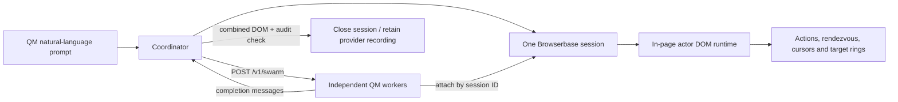

# Shared-browser handoff

## In one minute

**QM** is a multi-user agent harness: people use it through Slack or the web, while
scoped sessions supply an agent with a sandbox, tools, memory, credentials, and policy.
A **swarm** is QM's mechanism for giving one request multiple real worker sessions.

This branch adds a `shared-browser` skill. It lets a coordinator create **one** managed
browser, ask `/v1/swarm` for workers, and give every worker an actor identity and a
different page responsibility. Workers attach to that same Browserbase session and make
semantic, actor-scoped DOM requests. This exists for work that needs joint control of one
logged-in page or form, rather than several isolated browser sessions.

The starting point was Multi's browser-collaboration model: stable peers, visible cursors,
target highlights, and shared state. QM keeps those interaction concepts, but does not run
Multi's Socket.IO gateway, host/participant DOM replica, proxy, or cookie-sharing service.
Instead, all QM workers operate the same managed page over CDP; a small runtime in that page
coordinates actions and draws the UI.



## Runtime flow

1. The coordinator interprets the QM request, starts one Browserbase session, and opens the
   target URL. The session descriptor is local and mode `0600`; workers receive only the
   browser session ID, never the CDP URL or provider key.
2. The coordinator posts one `spawn` request to `/v1/swarm`, with a context per worker:
   `actorId`, assigned page region, and the shared Browserbase session ID. QM provisions and
   runs real worker sessions concurrently.
3. Each worker attaches to that one session using its own authorized credential, observes the
   live page, and sends `observe` or `act` operations through the injected runtime. Element
   references are assigned by that runtime, not by screen coordinates or global focus.
4. The runtime labels each actor with a stable color/cursor, target ring, and state. A shared
   `syncKey` creates a **browser-side** rendezvous: participants wait there and are released
   together. It then applies the requested DOM operation and records an in-page audit entry.
5. Workers report through `/v1/swarm`. The coordinator observes the combined live DOM and
   actor audit itself, then performs any single-owner navigation/submission only when allowed.
   Finally it releases the Browserbase session. The provider recording can be kept as QA
   evidence; the committed demo is one such recording.

## Code map

| Purpose | QM branch | Multi reference (`/Users/sethchang/multi-main`) |
| --- | --- | --- |
| User-facing contract and Google Form release gate | `skills-seed/shared-browser/SKILL.md` | `extension/README.md` |
| Start/attach/release managed browser | `skills-seed/shared-browser/scripts/launch.py` | — |
| Per-actor CDP client and local audit | `skills-seed/shared-browser/scripts/multi_agent.py` | — |
| In-page refs, semantic actions, HUD, barriers, audit | `skills-seed/shared-browser/extension/content.js` | `extension/entrypoints/content.ts`, `extension/classes/tracker.ts`, `extension/classes/renderer.ts` |
| QM worker API and durable swarm execution | `src/api/routes/swarms.ts`, `src/swarms/swarm-service.ts`, `docs/swarms.md` | `server/src/gateway/gateway.ts`, `server/src/session/session.service.ts` |
| Focused checks | `test/shared-browser-skill.test.ts` | `extension/entrypoints/content.ts` |
| Recorded, non-submitting Google Form run | `docs/demos/qm-google-form-dual-control.md`, `docs/demos/qm-google-form-dual-control.mp4` | — |

Multi's source architecture is a browser extension plus a Socket.IO signaling gateway: it elects
a host, relays participant actions, mirrors/patches DOM into participant views, and manages
proxied/cookie-backed views. QM intentionally replaces this with one provider-owned browser page
and an in-page command protocol, which avoids a copied DOM and a host authority for this use case.

## Run the Google Form demo

Use a disposable Google Form with at least four editable questions; do not submit a real form.
From a QM worker sandbox with the Browserbase credential authorized:

1. Read `skills-seed/browse/SKILL.md`, its Browserbase provider note, then
   `skills-seed/shared-browser/SKILL.md`. Follow their normal profile, approval, and credential
   rules.
2. Start one browser with `launch.py start`, targeting the form. Inspect it once as
   `coordinator` with `multi_agent.py ... observe`.
3. Spawn exactly two QM workers in one `POST /v1/swarm` call, using the task/context structure
   in the shared-browser skill. Give both workers the same browser session ID, distinct actor
   IDs, and disjoint fields.
4. Have both workers call `type` on separate fields with the same `--sync-key`,
   `--participants 2`, and a visible `--duration-ms`; assign the remaining fields separately.
5. Read both replies, then have the coordinator verify every field and both actor IDs in
   `multi_agent.py ... audit`. Do not accept worker reports alone. Submit only with explicit
   authorization; otherwise stop at the filled form.
6. Release the session with `launch.py close`. Run the focused static/parse check with:

   ```bash
   node --experimental-test-module-mocks --test test/shared-browser-skill.test.ts
   ```

The committed [demo notes](demos/qm-google-form-dual-control.md) link to the
[Browserbase recording](demos/qm-google-form-dual-control.mp4). It used one Browserbase session,
two real workers, a 5,013 ms synchronized-action overlap, verified four fields, and did not
submit the form.

## Constraints and known limits

- Worker **turns and browser-side waiting/actions can overlap**, but individual DOM commits run
  on the page's single JavaScript event loop. This is coordinated concurrency, not parallel DOM
  execution.
- The rendezvous lives in the browser page. All participants must reach the same `syncKey` and
  count before its 30-second timeout; it is not a QM-server distributed barrier.
- Assign separate page regions. On the same element, `fill` is last-completing-write-wins;
  `append` composes in commit order; `check`/`uncheck` are idempotent; two native clicks on a
  toggle can cancel each other. Navigation and submission are coordinator-only operations.
- The runtime currently handles visible, top-level-page semantic targets only. Stale references
  require another observe. It does not make arbitrary visual/canvas interactions conflict-free.
- Shared sessions using a personal profile or signed-in account are DM-only. The shared session
  ID is allowed in worker context; CDP URLs, provider keys, profile names, and live-view URLs are
  not.

## Status and next steps

The branch contains the shared-browser skill, Browserbase/Kernel launcher, actor runtime,
focused regression test, and a recorded Google Form QA run. The demo proves the intended
two-worker, one-browser path; it is not a general concurrency benchmark or a production
conflict-resolution system.

Recommended next work: repeat the release gate in the target deployment with its real worker
backend and approval posture; add a live integration test where credentials can be supplied
safely; define a user-visible policy for same-element conflicts; and decide whether the
in-page audit needs durable server-side ingestion before relying on it for compliance records.
